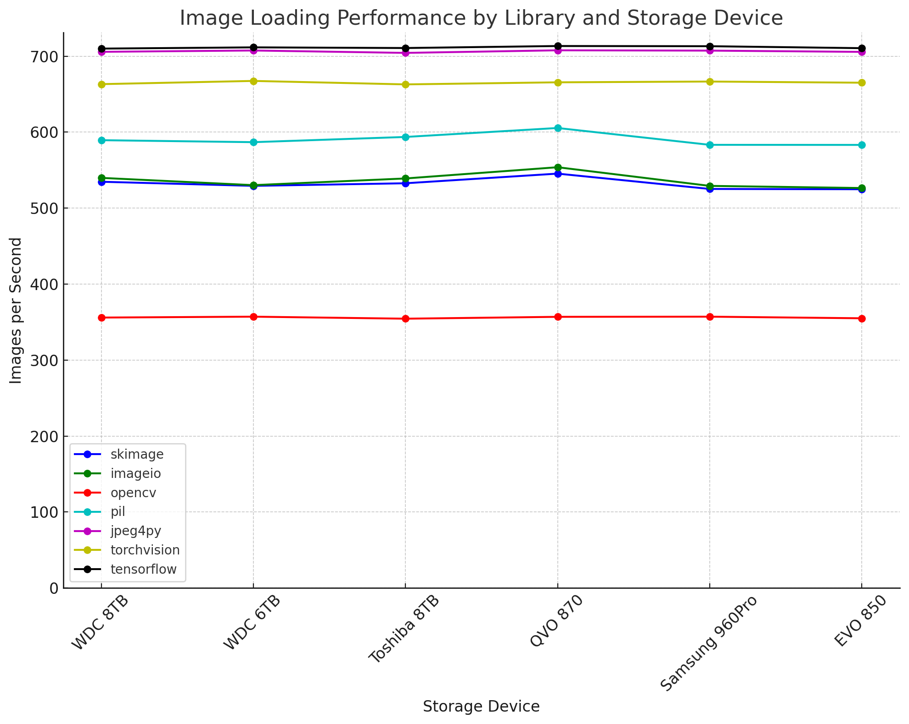

[](https://github.com/ambv/black)
[](https://github.com/astral-sh/ruff)

# Image Loading Benchmark: From JPG to RGB Numpy Arrays



This benchmark evaluates the efficiency of different libraries in loading JPG images and converting them into RGB numpy arrays, essential for neural network training data preparation. Inspired by the [Albumentations library](https://github.com/albumentations-team/albumentations/).

## Important Note on Image Conversion

In the benchmark, it's crucial to standardize image formats for a fair comparison, despite different default formats used by OpenCV (BGR), torchvision, and TensorFlow (tensors). A conversion step to RGB numpy arrays is included for consistency. Note that in typical use cases, torchvision and TensorFlow do not require this conversion. Preliminary analysis shows that this extra step does not significantly impact the comparative performance of the libraries, ensuring that the benchmark accurately reflects realistic end-to-end image loading and preprocessing times.

## Installation and Setup

Before running the benchmark, ensure your system is equipped with the necessary dependencies. Start by installing `libturbojpeg`:

```bash
sudo apt-get install libturbojpeg
```

or in OSX:

```bash
brew install jpeg-turbo
```

Next, install all required Python libraries listed in `requirements.txt`:

```bash
sudo apt install requirements.txt
```

## Measuring I/O Speed

Before diving into the image loading benchmark, it's beneficial to measure the I/O speed of your storage system:

```bash
sudo apt-get install hdparm
sudo hdparm -Tt <disk_id>
```

Replace <disk_id> with your disk identifier (e.g., `/dev/sda`). Here's an example output you might see:

```bash
/dev/sda:
 Timing cached reads:   26114 MB in  1.99 seconds = 13122.03 MB/sec
 Timing buffered disk reads: 1062 MB in  3.00 seconds = 353.70 MB/sec
```

## Running the Benchmark

To understand the benchmark's configuration options and run it according to your setup, use the following commands:

```bash
python imread_benchmark/benchmark.py -h

usage: benchmark.py [-h] [-d DIR] [-i N] [-r N] [--show-std] [-p] [-s]

Image reading libraries performance benchmark

options:
  -h, --help            show this help message and exit
  -d DIR, --data-dir DIR
                        path to a directory with images
  -i N, --num_images N  number of images for benchmarking (default: 2000)
  -r N, --num_runs N    number of runs for each benchmark (default: 5)
  --show-std            show standard deviation for benchmark runs
  -p, --print-package-versions
                        print versions of packages
  -s, --shuffle         Shuffle the list of images.
```


```bash
python imread_benchmark/benchmark.py \
    --data-dir <path to image folder> \
    --num_images <num_images> \
    --num_runs <number of runs> \
    --show-std \
    --print-package-versions \
    --print-package-versions
```

Extra options:
`--print-package-versions` - to print benchmarked libraries versions
`--print-package-versions` - to shuffle images on every run
`--show-std` - to show standard deviation for measurements

# Libraries benchmarked

* OpenCV
* pillow
* jpeg4py
* scikit-image (skimage)
* imageio
* torchvision
* tensorflow
* kornia-rs

## Image Loading Benchmark Results

### Hardware and Software Specifications

**CPU**: AMD Ryzen Threadripper 3970X 32-Core Processor
**Library Versions**:

- skimage: 0.22.0
- imageio: 2.34.0
- opencv: 4.9.0.80
- PIL (pillow): 10.2.0
- jpeg4py: 0.1.4
- torchvision: 0.17.1
- tensorflow: 2.15.0.post1

### Disk Models

- **QVO 870**: SAMSUNG 870 QVO SATA III 2.5" SSD 8TB (MZ-77Q8T0B)
- **Samsung 960Pro**: Samsung 960 PRO Series - 512GB PCIe NVMe - M.2 (MZ-V6P512BW)
- **WDC 8TB**: WD Red Pro 8TB NAS Internal Hard Drive - 7200 RPM, SATA 6 Gb/s (WD8003FFBX)
- **WDC 6TB**: WD Red Pro 6TB 3.5-Inch SATA III 7200rpm NAS Internal Hard Drive (WD6002FFWX)
- **Toshiba 8TB**: Toshiba X300 8TB Performance Desktop Gaming Hard Drive 7200 RPM 128MB Cache SATA 6.0Gb/s 3.5 inch (HDWF180XZSTA)
- **EVO 850**: Samsung 850 EVO 1 TB 2.5-Inch SATA III Internal SSD (MZ-75E1T0B/AM)

### Cached and Buffered Disk Reads

| Drive          | Cached Reads (MB/sec) | Buffered Reads (MB/sec) |
|----------------|-----------------------|-------------------------|
| WDC 8TB        | 9525.13               | 214.94                  |
| WDC 6TB        | 9391.21               | 205.18                  |
| Toshiba 8TB    | 9191.20               | 0.34 (335.86 kB/sec)    |
| QVO 870        | 9190.26               | 535.88                  |
| Samsung 960Pro | 9337.30               | 1968.49                 |
| EVO 850        | 9435.74               | 529.61                  |

### Image Loading Speed (images per second)

| Library     | WDC 8TB         | WDC 6TB         | Toshiba 8TB     | QVO 870         | Samsung 960Pro  | EVO 850         |
|-------------|-----------------|-----------------|-----------------|-----------------|-----------------|-----------------|
| skimage     | 534.71 ± 3.07   | 529.31 ± 7.06   | 532.71 ± 6.89   | 545.41 ± 5.38   | 525.24 ± 6.35   | 524.83 ± 5.46   |
| imageio     | 539.81 ± 4.03   | 530.22 ± 7.67   | 539.04 ± 3.44   | 553.83 ± 7.54   | 529.27 ± 9.27   | 526.44 ± 5.64   |
| opencv      | 355.93 ± 0.25   | 357.10 ± 0.16   | 354.44 ± 0.90   | 356.89 ± 0.94   | 357.10 ± 0.60   | 354.99 ± 0.54   |
| pil         | 589.42 ± 3.98   | 586.81 ± 6.79   | 593.68 ± 6.73   | 605.48 ± 9.53   | 583.32 ± 9.03   | 583.21 ± 5.95   |
| jpeg4py     | 705.75 ± 0.67   | 707.50 ± 1.91   | 704.34 ± 0.41   | 707.74 ± 0.73   | 707.33 ± 1.40   | 705.67 ± 1.80   |
| torchvision | 663.21 ± 1.08   | 667.44 ± 0.71   | 662.87 ± 0.11   | 665.61 ± 1.83   | 666.63 ± 1.30   | 665.09 ± 1.49   |
| tensorflow  | 709.99 ± 1.11   | 711.62 ± 1.03   | 710.75 ± 0.46   | 713.39 ± 0.83   | 713.14 ± 0.52   | 710.56 ± 1.33   |
