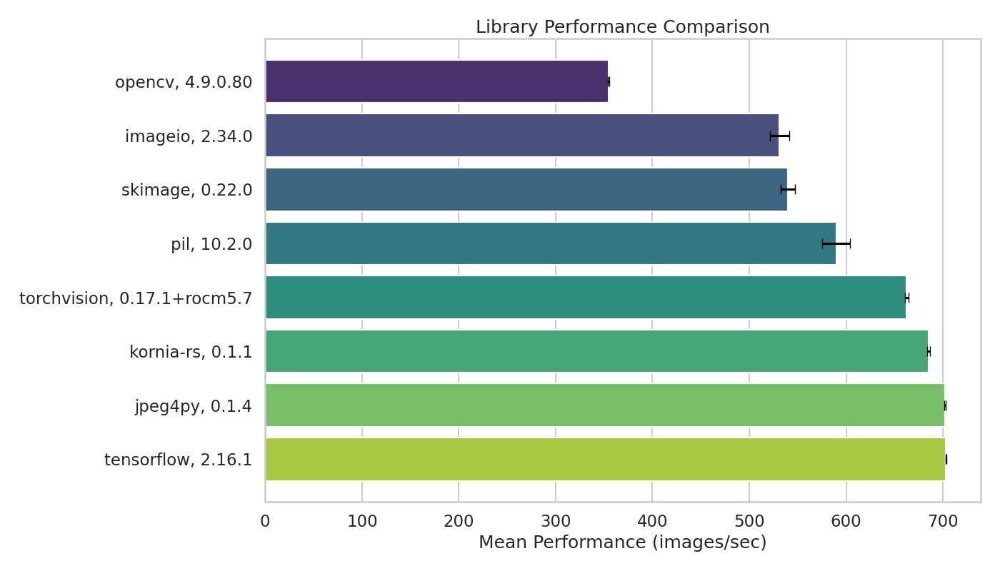

[](https://github.com/ambv/black)
[](https://github.com/astral-sh/ruff)

# Image Loading Benchmark: From JPG to RGB Numpy Arrays



This benchmark evaluates the efficiency of different libraries in loading JPG images and converting them into RGB numpy arrays, essential for neural network training data preparation. Inspired by the [Albumentations library](https://github.com/albumentations-team/albumentations/).

## Important Note on Image Conversion

In the benchmark, it's crucial to standardize image formats for a fair comparison, despite different default formats used by OpenCV (BGR), torchvision, and TensorFlow (tensors). A conversion step to RGB numpy arrays is included for consistency. Note that in typical use cases, torchvision and TensorFlow do not require this conversion. Preliminary analysis shows that this extra step does not significantly impact the comparative performance of the libraries, ensuring that the benchmark accurately reflects realistic end-to-end image loading and preprocessing times.

## Installation and Setup

Before running the benchmark, ensure your system is equipped with the necessary dependencies. Start by installing `libturbojpeg`:

```bash
sudo apt-get install libturbojpeg
```

Next, install all required Python libraries listed in `requirements.txt`:

```bash
sudo apt install requirements.txt
```

Note: If you want to update package versions in `requirements.txt`

```bash
pip install pip-tools
```

```bash
pip-compile requirements.in
```
this will create new `requirements.txt` file

```bash
pip install -r requirements.txt
```
to install latest versions

## Running the Benchmark

To understand the benchmark's configuration options and run it according to your setup, use the following commands:

```bash
python imread_benchmark/benchmark.py -h

usage: benchmark.py [-h] [-d DIR] [-n N] [-r N] [--show-std] [-m] [-p] [-s] [-o OUTPUT_PATH]

Image reading libraries performance benchmark

options:
  -h, --help            show this help message and exit
  -d DIR, --data-dir DIR
                        path to a directory with images
  -n N, --num_images N  number of images for benchmarking (default: 2000)
  -r N, --num_runs N    number of runs for each benchmark (default: 5)
  --show-std            show standard deviation for benchmark runs
  -m, --markdown        print benchmarking results as a markdown table
  -p, --print-package-versions
                        print versions of packages
  -s, --shuffle         Shuffle the list of images.
  -o OUTPUT_PATH, --output_path OUTPUT_PATH
                        Path to save resulting dataframe.
```


```bash
python imread_benchmark/benchmark.py \
    --data-dir <path to image folder> \
    --num_images <num_images> \
    --num_runs <number of runs> \
    --show-std \
    --print-package-versions \
    --print-package-versions
```

Extra options:
`--print-package-versions` - to print benchmarked libraries versions
`--print-package-versions` - to shuffle images on every run
`--show-std` - to show standard deviation for measurements

## Hardware and Software Specifications

**CPU**: AMD Ryzen Threadripper 3970X 32-Core Processor

## Results

|    | Library     | Version        | Performance (images/sec)   |
|---:|:------------|:---------------|:---------------------------|
|  0 | skimage     | 0.22.0         | 539.93 ± 7.68              |
|  1 | imageio     | 2.34.0         | 531.24 ± 10.10             |
|  2 | opencv      | 4.9.0.80       | 354.63 ± 0.54              |
|  3 | pil         | 10.2.0         | 589.74 ± 14.64             |
|  4 | jpeg4py     | 0.1.4          | 701.98 ± 0.79              |
|  5 | torchvision | 0.17.1+rocm5.7 | 662.68 ± 1.66              |
|  6 | tensorflow  | 2.16.1         | 703.24 ± 0.63              |
|  7 | kornia      | 0.1.1          | 685.13 ± 1.29              |
