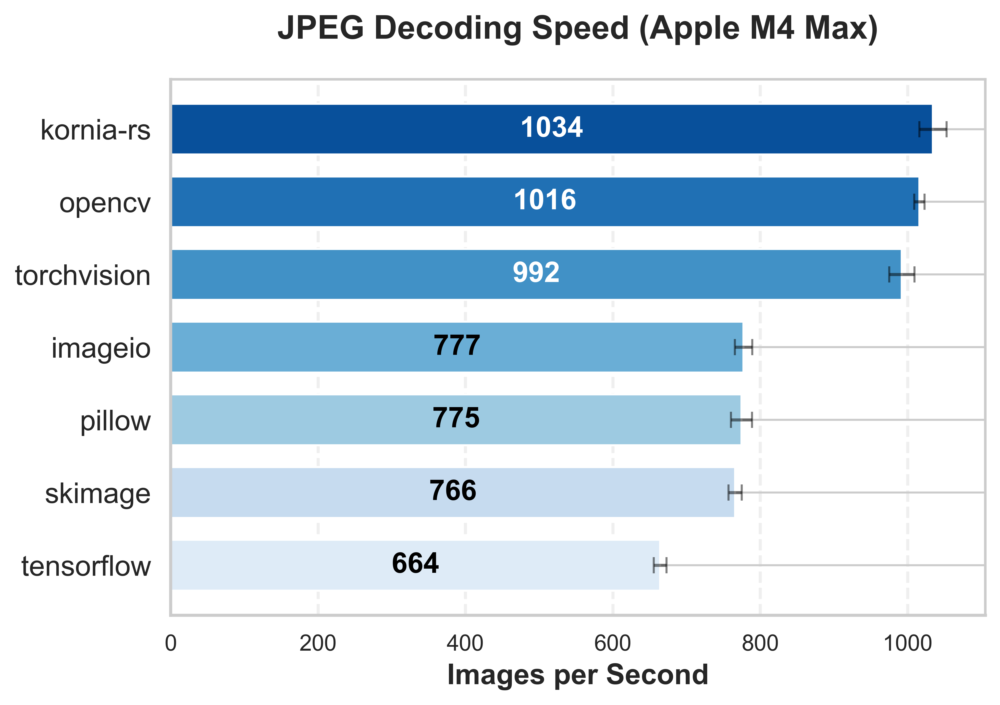
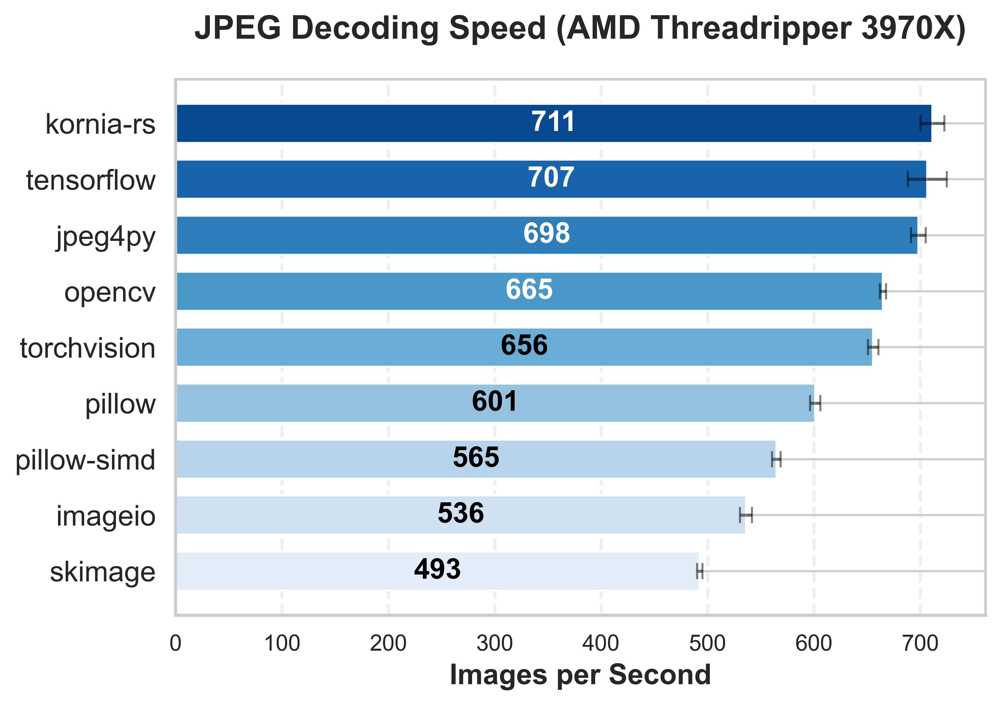

# Image Loading Benchmark
## Overview

This benchmark evaluates the efficiency of different libraries in loading JPG images
and converting them into RGB numpy arrays, essential for neural network training
data preparation. The study compares traditional image processing libraries (Pillow, OpenCV),
machine learning frameworks (TensorFlow, PyTorch), and specialized decoders (jpeg4py, kornia-rs)
across different computing architectures.

<table>
  <tr>
    <td></td>
    <td></td>
  </tr>
  <tr>
    <td align="center">Performance on Apple Silicon (M4 Max)</td>
    <td align="center">Performance on Linux (AMD Threadripper)</td>
  </tr>
</table>

## Important Note on Image Conversion

In the benchmark, it's crucial to standardize image formats for a fair comparison.
Different libraries use different default formats: OpenCV (BGR), torchvision and
TensorFlow (tensors). A conversion step to RGB numpy arrays is included for
consistency. Note that in typical use cases, torchvision and TensorFlow do not
require this conversion.

## Installation and Setup

Before running the benchmark, ensure your system is equipped with the necessary
dependencies:

### System Requirements

```bash
# On Ubuntu/Debian
sudo apt-get install libturbojpeg
```
### Python Setup

The benchmark uses separate virtual environments for each library to avoid
dependency conflicts. You'll need:

```bash
# Install uv for faster package installation
pip install uv
```

## Running the Benchmark

To reproduce the benchmarks, you'll need the ImageNet validation dataset:

Download the validation set (50,000 images, ~6.3GB):

```bash
wget https://image-net.org/data/ILSVRC/2012/ILSVRC2012_img_val.tar
```

Create a directory and extract the images:

```bash
mkdir -p imagenet/val
tar -xf ILSVRC2012_img_val.tar -C imagenet/val
```

The benchmark script creates separate virtual environments for each library and
runs tests independently:

```bash
# Make the script executable
chmod +x run_benchmarks.sh

# Show help and options
./run_benchmarks.sh --help

# Run benchmark with default settings (2000 images, 5 runs)
./run_benchmarks.sh /path/to/images

# Run with custom settings
./run_benchmarks.sh /path/to/images 1000 3
```

The script will:

1. Create separate virtual environments for each library
2. Install required dependencies using `uv`
3. Run benchmarks independently
4. Save results to OS-specific directories

### Results Structure

Results are saved in JSON format under:

```text
output/
├── linux/          # When run on Linux
│   ├── opencv_results.json
│   ├── pil_results.json
│   └── ...
└── darwin/         # When run on macOS
    ├── opencv_results.json
    ├── pil_results.json
    └── ...
```

## Libraries Being Benchmarked

Each library uses different underlying JPEG decoders and implementation approaches:

### Direct libjpeg-turbo Users (Fastest)
- jpeg4py (Linux only) - Direct libjpeg-turbo binding
- kornia-rs - Modern Rust-based implementation
- OpenCV (opencv-python-headless)
- torchvision

### Standard libjpeg Users
- PIL (Pillow)
- Pillow-SIMD (Linux only)
- scikit-image
- imageio

### Machine Learning Framework Components
- tensorflow
- torchvision
- kornia-rs


## Performance Considerations

Several factors influence real-world performance beyond raw decoding speed:

### Memory Usage
- Memory utilization varies significantly across libraries
- Some implementations (like kornia-rs) have specific memory allocation optimizations
- Consider available system resources when scaling to batch processing

### System Integration
- All benchmarks performed on NVMe SSDs to minimize I/O variance
- Single-threaded performance reported
- Multi-threading capabilities vary between libraries

### Image Characteristics
- Results based on typical ImageNet JPEG images (~500x400 pixels)
- Performance scaling with image size varies between implementations
- Compression ratio and JPEG encoding parameters can influence decoding speed

## Recommendations

### High-Performance Applications
- Use kornia-rs or OpenCV for consistent cross-platform performance
- On Linux, consider jpeg4py for maximum performance
- Consider memory usage if processing many images simultaneously

### Cross-Platform Development
- kornia-rs provides the most consistent performance
- OpenCV and torchvision offer good balance of features and speed
- Test with representative image sizes and batching patterns

### Feature-Rich Applications
- When needing extensive image processing features, OpenCV remains a strong choice
- Consider dependency size and installation complexity
- Evaluate the full image processing pipeline, not just JPEG decoding


## Citation

If you found this work useful, please cite:
```bibtex
@misc{iglovikov2025speed,
      title={Need for Speed: A Comprehensive Benchmark of JPEG Decoders in Python},
      author={Vladimir Iglovikov},
      year={2025},
      eprint={2501.13131},
      archivePrefix={arXiv},
      primaryClass={eess.IV},
      doi={10.48550/arXiv.2501.13131}
}
```
