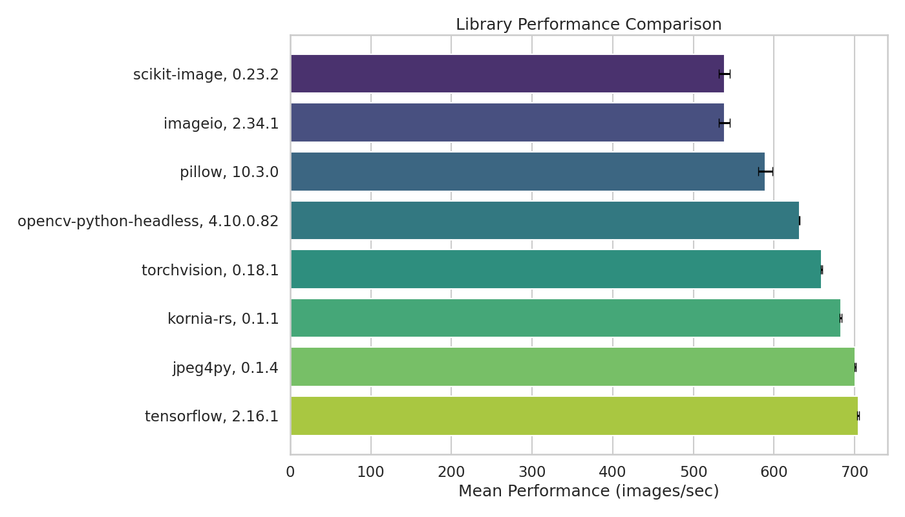

# Image Loading Benchmark

[](https://github.com/astral-sh/ruff)

## Overview

This benchmark evaluates the efficiency of different libraries in loading JPG images
and converting them into RGB numpy arrays, essential for neural network training
data preparation. Inspired by the [Albumentations library](
https://github.com/albumentations-team/albumentations/).



## Important Note on Image Conversion

In the benchmark, it's crucial to standardize image formats for a fair comparison.
Different libraries use different default formats: OpenCV (BGR), torchvision and
TensorFlow (tensors). A conversion step to RGB numpy arrays is included for
consistency. Note that in typical use cases, torchvision and TensorFlow do not
require this conversion.

## Installation and Setup

Before running the benchmark, ensure your system is equipped with the necessary
dependencies:

### System Requirements

```bash
# On Ubuntu/Debian
sudo apt-get install libturbojpeg

# On macOS
brew install libjpeg-turbo
```

### Python Setup

The benchmark uses separate virtual environments for each library to avoid
dependency conflicts. You'll need:

```bash
# Install uv for faster package installation
pip install uv
```

## Running the Benchmark

The benchmark script creates separate virtual environments for each library and
runs tests independently:

```bash
# Make the script executable
chmod +x run_benchmarks.sh

# Show help and options
./run_benchmarks.sh --help

# Run benchmark with default settings (2000 images, 5 runs)
./run_benchmarks.sh /path/to/images

# Run with custom settings
./run_benchmarks.sh /path/to/images 1000 3
```

The script will:

1. Create separate virtual environments for each library
2. Install required dependencies using `uv`
3. Run benchmarks independently
4. Save results to OS-specific directories

### Results Structure

Results are saved in JSON format under:

```text
output/
├── linux/          # When run on Linux
│   ├── opencv_results.json
│   ├── pil_results.json
│   └── ...
└── darwin/         # When run on macOS
    ├── opencv_results.json
    ├── pil_results.json
    └── ...
```

## Libraries Being Benchmarked

- OpenCV (opencv-python-headless)
- PIL (Pillow)
- Pillow-SIMD (pillow-simd)
- scikit-image
- imageio
- torchvision
- tensorflow
- kornia-rs
- jpeg4py

## Hardware and Software Specifications

**CPU**: AMD Ryzen Threadripper 3970X 32-Core Processor

## Latest Results

|    | Library                | Version   | Performance (images/sec)   |
|---:|:-----------------------|:----------|:---------------------------|
|  0 | scikit-image          | 0.23.2    | 538.48 ± 6.86             |
|  1 | imageio               | 2.34.1    | 538.58 ± 6.84             |
|  2 | opencv-python-headless| 4.10.0.82 | 631.46 ± 0.43             |
|  3 | pillow                | 10.3.0    | 589.56 ± 8.79             |
|  4 | jpeg4py               | 0.1.4     | 700.60 ± 0.88             |
|  5 | torchvision           | 0.18.1    | 658.68 ± 0.78             |
|  6 | tensorflow            | 2.16.1    | 704.43 ± 1.10             |
|  7 | kornia-rs             | 0.1.1     | 682.95 ± 1.21             |

## Contributing

Feel free to submit issues and enhancement requests!
