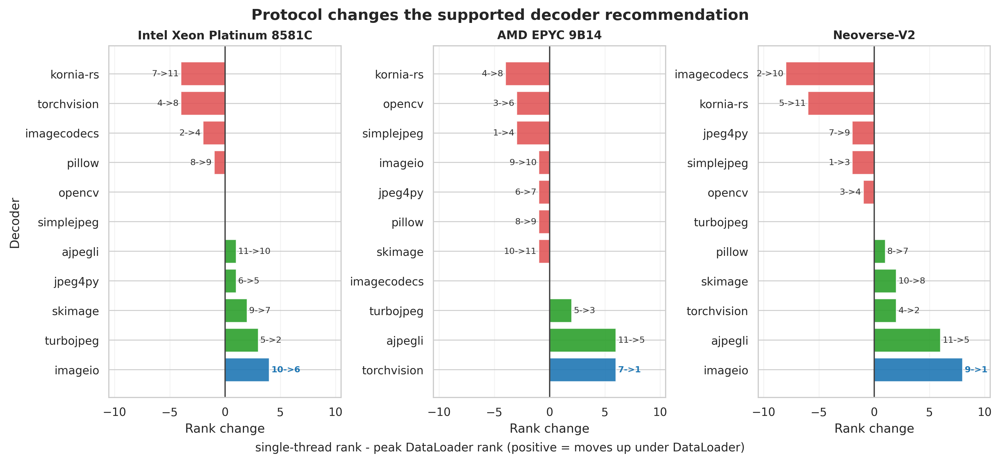
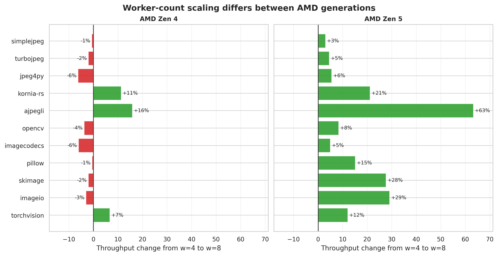
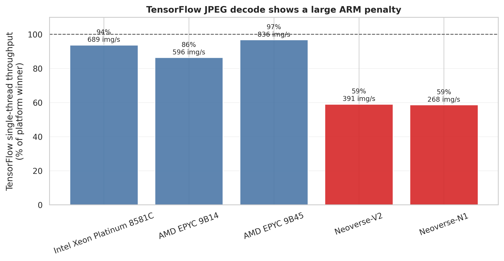
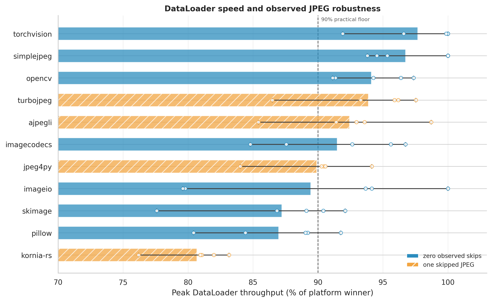

# imread-benchmark

## Overview

`imread-benchmark` is a reproducible benchmark framework for JPEG decoding in Python ML pipelines. It provides:

- an installable `imread-benchmark` CLI for local datasets,
- isolated per-library worker environments so conflicting stacks can be benchmarked in one run,
- PyTorch `DataLoader` throughput measurements in addition to single-thread decoder speed,
- Google Cloud runners for repeatable cloud CPU comparisons, and
- JSON outputs plus generated plots/tables for README, docs, and publication-ready analysis.

The default benchmark uses the ImageNet validation set and reports RGB `uint8` decode throughput across common Python libraries and CPU families.

## Results

The plots and tables below are generated from `output/<platform>/*.json`. To refresh after a new run:

```bash
imread-benchmark plot --input output --output docs/assets/benchmarks
imread-benchmark render-readme
```

The figures below are claim-first summaries: full numeric matrices remain in the tables.









### Single-thread decode throughput (img/s)

Pure decode speed with one thread, bytes pre-loaded to memory. **Bold** = best per platform.

<!-- BENCH:single_thread:start -->

| Library | AMD EPYC 9B14 | AMD EPYC 9B45 | Intel Xeon Platinum 8581C | Neoverse-N1 | Neoverse-V2 |
| :--- | ---: | ---: | ---: | ---: | ---: |
| `simplejpeg` | **690** | 857 | **735** | 456 | **662** |
| `turbojpeg` | 640 | 818 | 708 | 426 | 613 |
| `jpeg4py` | 636 | 760 | 699 | 423 | 611 |
| `kornia-rs` | 642 | 761 | 664 | 391 | 629 |
| `opencv` | 664 | 841 | 721 | 445 | 645 |
| `imagecodecs` | 677 | 775 | 723 | **457** | 661 |
| `pyvips` | 420 | 586 | 462 | 261 | 413 |
| `pillow` | 537 | 726 | 577 | 360 | 551 |
| `skimage` | 475 | 661 | 525 | 326 | 499 |
| `imageio` | 496 | 599 | 524 | 335 | 506 |
| `torchvision` | 621 | **864** | 712 | 440 | 643 |
| `tensorflow` | 596 | 836 | 689 | 268 | 391 |

<!-- BENCH:single_thread:end -->

### Peak DataLoader throughput (img/s)

Best `images_per_second` across `num_workers ∈ {0, 2, 4, 8}` for each library × platform, using a PyTorch DataLoader with `batch_size=32`. Cell format: `img/s @ Nw`. **Bold** = best per platform.

<!-- BENCH:dataloader:start -->

| Library | AMD EPYC 9B14 | AMD EPYC 9B45 | Intel Xeon Platinum 8581C | Neoverse-N1 | Neoverse-V2 |
| :--- | ---: | ---: | ---: | ---: | ---: |
| `simplejpeg` | 1,521 @ 4w | 2,739 @ 8w | **1,754 @ 8w** | **1,557 @ 8w** | 2,421 @ 8w |
| `turbojpeg` | 1,535 @ 4w | 2,800 @ 8w | 1,710 @ 8w | 1,347 @ 4w | 2,389 @ 8w |
| `jpeg4py` | 1,443 @ 4w | 2,453 @ 8w | 1,651 @ 8w | 1,411 @ 8w | 2,312 @ 8w |
| `kornia-rs` | 1,327 @ 8w | 2,394 @ 8w | 1,422 @ 8w | 1,260 @ 8w | 1,951 @ 8w |
| `opencv` | 1,457 @ 4w | 2,814 @ 8w | 1,707 @ 8w | 1,419 @ 8w | 2,414 @ 8w |
| `imagecodecs` | 1,543 @ 4w | 2,476 @ 8w | 1,677 @ 8w | 1,443 @ 8w | 2,242 @ 8w |
| `pillow` | 1,283 @ 4w | 2,465 @ 8w | 1,565 @ 8w | 1,387 @ 8w | 2,350 @ 8w |
| `skimage` | 1,238 @ 4w | 2,536 @ 8w | 1,615 @ 8w | 1,388 @ 8w | 2,315 @ 8w |
| `imageio` | 1,273 @ 4w | 2,324 @ 8w | 1,643 @ 8w | 1,466 @ 8w | **2,561 @ 8w** |
| `torchvision` | **1,596 @ 8w** | **2,920 @ 8w** | 1,612 @ 4w | 1,504 @ 8w | 2,557 @ 8w |

<!-- BENCH:dataloader:end -->

<!-- BENCH:metadata:start -->

_**5 platforms** · 50,000 images · 5 runs each · latest run 2026-04-22_

<!-- BENCH:metadata:end -->

### What the results mean

Single-thread decoder speed is useful, but it is not enough to choose a decoder for a training pipeline. The peak `DataLoader` table is usually the better operational signal because it captures multiprocessing worker behavior, library fork-safety, and CPU-specific scaling.

Current headline patterns:

- `simplejpeg` is a strong single-thread baseline and wins peak `DataLoader` throughput on Intel Emerald Rapids and Neoverse N1.
- `torchvision` wins both AMD platforms at peak `DataLoader` throughput and is effectively tied for first on Neoverse V2.
- `imageio` is not a single-thread leader, but wins peak `DataLoader` throughput on Neoverse V2 in the current GCP runs.
- OpenCV is rarely the absolute winner, but is consistently close to the local winner and has successful `DataLoader` results on every platform.
- PyVips is reported for single-thread decode only; it is skipped in fork-based `DataLoader` benchmarks because of libvips threadpool deadlocks in this harness.

## GitAds Sponsored

[Sponsored by GitAds](https://gitads.dev/v1/ad-track?source=ternaus/imread_benchmark@github)

## Important Note on Image Conversion

All decoders output `(H, W, 3)` uint8 RGB numpy arrays for a fair comparison. Libraries that default to other formats (OpenCV → BGR, torchvision → CHW tensor, TensorFlow → EagerTensor) include a conversion step. Note that in real ML pipelines the conversion is often unnecessary.

## Benchmark Modes

**Memory mode** (default): images are pre-loaded as bytes before the timed loop. This measures pure decode throughput with no disk I/O.

**Disk mode**: each decode call reads the file from disk. Includes I/O latency.

## Dataset

[ImageNet validation set](https://image-net.org) — 50,000 JPEG images, ~500×400px.

```bash
# Download
wget https://image-net.org/data/ILSVRC/2012/ILSVRC2012_img_val.tar
mkdir -p imagenet/val
tar -xf ILSVRC2012_img_val.tar -C imagenet/val
```

## System Requirements

```bash
# macOS only: required by PyTurboJPEG (pure-python ctypes binding)
brew install jpeg-turbo
```

`pyvips` ships its own bundled libvips via the `pyvips-binary` PyPI wheel,
so no `brew install vips` is needed. `simplejpeg` wheels bundle libjpeg-turbo.
On Linux you'll still need `apt install libjpeg-turbo8-dev libturbojpeg0`
(see `gcp/vm_startup.sh`), since `jpeg4py` is built from sdist.

## Installation

```bash
# Install uv if needed
pip install uv

# Install the lightweight orchestrator (control plane).
uv venv && source .venv/bin/activate
uv pip install -e .
```

The benchmark CLI creates decoder worker environments automatically under
`venvs/<group>/` when `imread-benchmark run` needs them. Today the groups are
`mainstream` and `tensorflow`; they are separate because TensorFlow and
PyTorch-oriented packages can have incompatible NumPy/protobuf constraints.
The first full run pays the dependency installation cost, and later runs reuse
the populated worker environments. Use `--skip-setup` only when those worker
environments already exist and should not be modified.

Plotting is separate from benchmark execution. Install the plotting extra only
if you want to regenerate figures:

```bash
uv pip install -e '.[plot]'
```

## Running the Benchmark

```bash
# What would run on this machine?
imread-benchmark list-libs

# Single + DataLoader for every supported decoder, default 50k images
imread-benchmark run --data-dir /path/to/imagenet/val

# Faster smoke run
imread-benchmark run --data-dir /path/to/imagenet/val \
    --num-images 2000 --num-runs 5 --dataloader-runs 2 \
    --workers 0,2

# Just one library, single-thread benchmark only
imread-benchmark run --data-dir /path/to/imagenet/val \
    --libs opencv --mode single

# Generate README plots from output/ JSONs
imread-benchmark plot --input output --output docs/assets/benchmarks
```

The CLI sets up `venvs/<group>/` for each dependency group it needs. Subsequent runs reuse those venvs, so only the first invocation pays the install cost.

## Running on Google Cloud

Spin up a benchmark VM on GCP, run everything against ImageNet from a GCS bucket, and have it self-delete when done:

```bash
./gcp/run.sh \
    --imagenet-bucket gs://my-bucket/imagenet/val \
    --results-bucket  gs://my-bucket/imread-results \
    --no-wait
```

Built venvs are cached in GCS (keyed by `sha256(uv.lock)`), so reruns on the same machine type skip the ~25-minute install. Use `--force-rebuild` to re-resolve PyPI without editing `uv.lock`. Full details, machine-type matrix, cost, and cache semantics: [docs/gcp_benchmarks.md](docs/gcp_benchmarks.md).

## Results Structure

```
output/
└── linux_AMD-EPYC-9B45/
    ├── opencv_1t_results.json
    ├── opencv_default_results.json
    ├── opencv_dataloader_results.json
    ├── run_summary.json
    └── ...
```

## Libraries Benchmarked

### Direct libjpeg-turbo (fastest)

- **simplejpeg** — CFFI binding; zero-copy decode from bytes
- **turbojpeg** (PyTurboJPEG) — Python binding for libjpeg-turbo
- **jpeg4py** — direct libjpeg-turbo binding (**Linux only**)
- **kornia-rs** — Rust implementation using libjpeg-turbo
- **OpenCV** (opencv-python-headless)

### Comprehensive codec libraries

- **imagecodecs** — uses libjpeg-turbo 3.x; prebuilt ARM64 wheels
- **pyvips** — libvips bindings (bundled in wheels). Single-thread only;
  the libvips threadpool deadlocks under fork-based PyTorch DataLoader,
  so dataloader benchmarks are skipped on every platform.

### Standard libjpeg

- **Pillow**
- **scikit-image**
- **imageio**

> **Note:** Pillow-SIMD was previously included but dropped 2026-04 —
> upstream is abandoned (last release 2023-05), no Linux wheels, and its
> historical SIMD speedup is now matched by `jpeg4py` / `simplejpeg` /
> `kornia-rs`. Full rationale in
> [`docs/gcp_benchmarks.md`](docs/gcp_benchmarks.md#why-no-pillow-simd).

### ML framework components

- **torchvision**
- **tensorflow**

## Performance Considerations

- All benchmarks run single-threaded unless using the DataLoader benchmark
- Memory mode is the recommended baseline — it isolates decode speed from storage
- Results based on ImageNet JPEG images (~500×400px)

## Recommendations

### Choosing for ML training

- Use the DataLoader benchmark for final decoder and `num_workers` selection.
- Start with OpenCV when you need a robust default that runs everywhere.
- Try `torchvision` when your pipeline already wants tensors and you can benchmark the target CPU.
- Try `simplejpeg` / `turbojpeg` / `jpeg4py` when maximum libjpeg-turbo-backed speed matters and your dataset policy handles uncommon JPEG modes.

### Choosing for pure decode speed

- Use the single-thread table to compare isolated decoder implementations.
- Re-run locally if your images differ substantially from ImageNet validation JPEGs.

### Choosing for feature-rich applications

- `opencv` remains the best choice when you need more than just JPEG decoding

## Paper and Publication Assets

The public README plots are generated under `docs/assets/benchmarks/`:

```bash
imread-benchmark plot --input output --output docs/assets/benchmarks
imread-benchmark render-readme
```

Publication-style tables and figures are generated from the same JSON outputs into ignored local files under `_internal/papers/`:

```bash
uv run --extra plot python -m tools.paper_assets --all
```

`_internal/` is intentionally gitignored. Commit the source JSON and public README assets, not local manuscript drafts or generated paper PDFs.

## Development

```bash
# Run tests
uv run pytest tests/ -v

# Run linters
uv run pre-commit run --all-files
```

See [CONTRIBUTING.md](CONTRIBUTING.md) for how to add a new decoder.

## Citation

If you found this work useful, please cite:

```bibtex
@misc{iglovikov2025speed,
      title={Need for Speed: A Comprehensive Benchmark of JPEG Decoders in Python},
      author={Vladimir Iglovikov},
      year={2025},
      eprint={2501.13131},
      archivePrefix={arXiv},
      primaryClass={eess.IV},
      doi={10.48550/arXiv.2501.13131}
}
```
